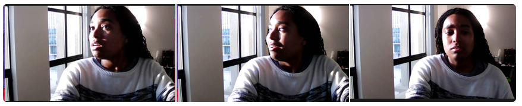

# A girl like me

I just have opinions about stuff. I have thoughts and I don't just hold those thoughts inside I speak about them and sometimes they are controversial. I think I may a prime example of 
cancel culture in action. I am not really sure what cancel culture means besides create a new table or group and bring other with similar sentiment to yuor new table. 

A part os this idealism that becomes weird, is the fact that my identity crosses so many lines and has so many interesections. 
I am -

- female
- black American
- african
- literate
- cultured
- well traveled
- single
- apartment dweller and previous home owner

Who has a story like mine? And those are just the aspects of my identity that I can think of right now. If I were to take the time to think about this in more depth and really
start to unpack aspects of myself that I believe make me who I am I think I would really start to get into how and why I am who I am today and I don't think it conforms to what so many
think and understand about what it means to be a black female in society today. I don't want to become palatable for others, that has never been my goal but I also think that
it is a bit weird to feel like such an outsider as an adult?. Maybe this is just something that really does happen as you grow out of people. As you grow away from others. 
